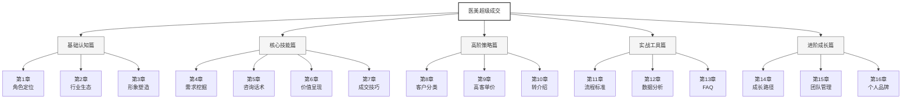
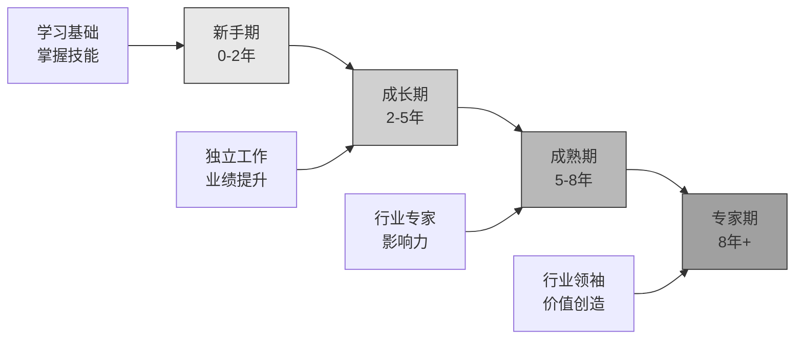
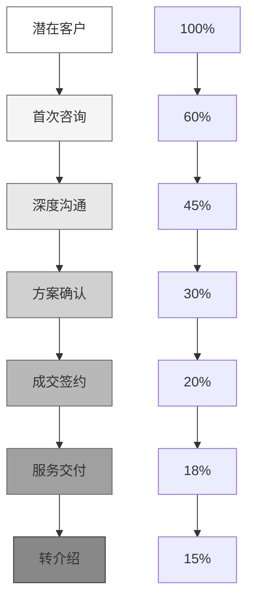

# 全书架构图

## 全书整体架构

```mermaid
graph TB
    A[医美超级成交] --> B[基础认知篇]
    A --> C[核心技能篇]
    A --> D[高阶策略篇]
    A --> E[实战工具篇]
    A --> F[进阶成长篇]

    B --> B1[第1章<br/>角色定位]
    B --> B2[第2章<br/>行业生态]
    B --> B3[第3章<br/>形象塑造]

    C --> C1[第4章<br/>需求挖掘]
    C --> C2[第5章<br/>咨询话术]
    C --> C3[第6章<br/>价值呈现]
    C --> C4[第7章<br/>成交技巧]

    D --> D1[第8章<br/>客户分类]
    D --> D2[第9章<br/>高客单价]
    D --> D3[第10章<br/>转介绍]

    E --> E1[第11章<br/>流程标准]
    E --> E2[第12章<br/>数据分析]
    E --> E3[第13章<br/>FAQ]

    F --> F1[第14章<br/>成长路径]
    F --> F2[第15章<br/>团队管理]
    F --> F3[第16章<br/>个人品牌]

    style A fill:#fff,stroke:#333,stroke-width:2px
    style B fill:#f5f5f5,stroke:#666,stroke-width:1px
    style C fill:#f5f5f5,stroke:#666,stroke-width:1px
    style D fill:#f5f5f5,stroke:#666,stroke-width:1px
    style E fill:#f5f5f5,stroke:#666,stroke-width:1px
    style F fill:#f5f5f5,stroke:#666,stroke-width:1px
```

## 咨询师成长路径图

```mermaid
graph LR
    A[新手期<br/>0-2年] --> B[成长期<br/>2-5年]
    B --> C[成熟期<br/>5-8年]
    C --> D[专家期<br/>8年+]

    A1[学习基础<br/>掌握技能] --> A
    B1[独立工作<br/>业绩提升] --> B
    C1[行业专家<br/>影响力] --> C
    D1[行业领袖<br/>价值创造] --> D

    style A fill:#e8e8e8,stroke:#333
    style B fill:#d0d0d0,stroke:#333
    style C fill:#b8b8b8,stroke:#333
    style D fill:#a0a0a0,stroke:#333
```

## 客户转化漏斗

```mermaid
graph TD
    A[潜在客户] --> B[首次咨询]
    B --> C[深度沟通]
    C --> D[方案确认]
    D --> E[成交签约]
    E --> F[服务交付]
    F --> G[转介绍]

    A1[100%] --> B1[60%]
    B1 --> C1[45%]
    C1 --> D1[30%]
    D1 --> E1[20%]
    E1 --> F1[18%]
    F1 --> G1[15%]

    style A fill:#fff,stroke:#666
    style B fill:#f5f5f5,stroke:#666
    style C fill:#e8e8e8,stroke:#666
    style D fill:#d0d0d0,stroke:#666
    style E fill:#b8b8b8,stroke:#666
    style F fill:#a0a0a0,stroke:#666
    style G fill:#888,stroke:#333
```
